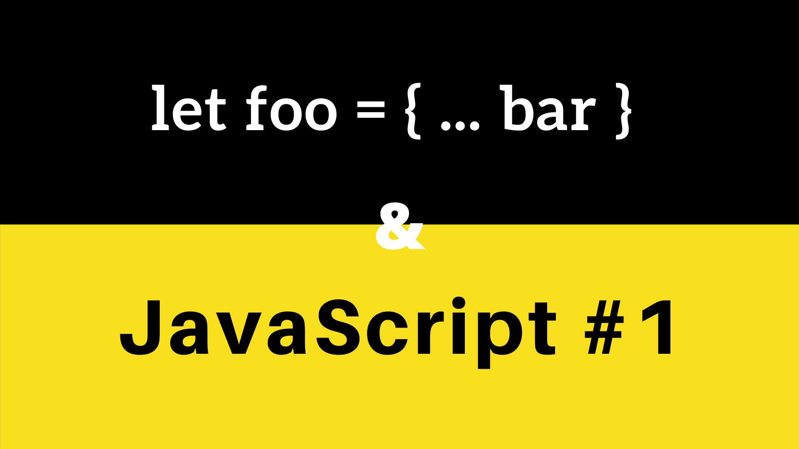

# JS Tips #1 : Cloner un objet

## Les types primitifs
*"Tous les types, sauf les objets, définissent des valeurs immuables (qu'on ne peut modifier). Ainsi, contrairement au C, les chaînes de caractères sont immuables en JavaScript. Les valeurs immuables pour chacun de ces types sont appelées « valeurs primitives »."* -- Developer Mozilla

Essayons de cloner deux variables de type primitif et de modifier la valeur de l'une des deux variables :

```javascript
let a = 'a';
let b = a;

console.log(`a : ${a}, b : ${b}`); // a : a, b : a

b = 'c';

console.log(`a : ${a}, b : ${b}`); // a : a, b : c
```

**La modification de la variable *b* n'affecte pas la valeur de *a*. Ce comportement est valable pour tous les types primitifs.**
 
## Les objets
*"En informatique, un objet est une valeur conservée en mémoire à laquelle on fait référence grâce à un identifiant."* -- Developer Mozilla

### Cloner un objet simple
Clonons deux objets "simples" et modifions la valeur de l'un des deux.

```javascript
let objectA = {
    "name": "toto"
};
let objectB = objectA;

console.log('objectA : ', objectA); // objectA :  { name: 'toto' }
console.log('objectB : ', objectB); // objectB :  { name: 'toto' }

objectB.name = 'titi';

console.log('objectA : ', objectA); // objectA :  { name: 'titi' }
console.log('objectB : ', objectB); // objectB :  { name: 'titi' }
```

La modification de l'objet *objectB* affecte la valeur de *objectA*. Cela est du au fait que les deux objets font référence à la même adresse mémoire. Lorsque vous modifiez un objet faisant référence à une adresse mémoire, vous modifiez la valeur pour l'ensemble des références.


**Comment clonner correctement objet, tout en ayant deux références indépendantes faisant références à deux adresses mémoires différentes ?**

#### Spread Operator
L'utilisation du *spread operator* ou de la *syntaxe de décomposition* permet de créer un nouvel objet simple en reprenant les propriétes de l'objet existant.

```javascript
let objectA = { "name": "toto" };

let objectB = {... objectA};

console.log('objectA : ', objectA); // objectA :  { name: 'toto' }

console.log('objectB : ', objectB); // objectB :  { name: 'toto' }


objectB.name = 'titi';

console.log('objectA : ', objectA); // objectA :  { name: 'toto' }

console.log('objectB : ', objectB); // objectB :  { name: 'titi' }
```

En utilisant la *syntaxe de décomposition*, on a maintenant deux objets, comprenant la même proprieté *name* mais faisant tout deux références à deux adresses mémoires différentes.

> Le *spread operator* ne copie ni les propriétes héritées ni les informations de la classe.

#### Object.assign()
*La méthode Object.assign() est utilisée afin de copier les valeurs de toutes les propriétés directes (non héritées) d'un objet qui sont énumérables sur un autre objet cible. Cette méthode renvoie l'objet cible.* -- Developer Mozilla

Globalement, en passant comme premier argument `{}`, la méthode effectue la même chose que le *spread operator*. Cependant, la méthode déclenche les mutateurs de l'objet (voir la documentation officielle).

```javascript
let objectA = { "name": "toto" };

let objectB =  Object.assign({}, objectA);

console.log('objectA : ', objectA);
// objectA :  { name: 'toto' }
console.log('objectB : ', objectB);
// objectB :  { name: 'toto' }

objectB.name = 'titi';

console.log('objectA : ', objectA);
// objectA :  { name: 'toto' }
console.log('objectB : ', objectB);
// objectB :  { name: 'titi' }
```
 
> Comme la *syntaxe de décompostion*, *Object.assign()* ne copie ni les propriétes héritées ni les informations de la classe.

### Cloner un objet complexe

#### Spread Operator & Object.assign()
Lorsque je parle de cloner un objet complexe, je parle de *deep copy* (copie en profondeur).

Essayons de cloner cet objet : 
```javascript
let catA = {
    identity: {
        name: "Figaro",
        movie: "Pinnochio"
    },
    color: "Black and White",

    meow() {
        console.log(`${this.identity.name} meows !!`)
    }
};

let catB = { ...catA };

console.log('catA : ', catA);
/*
catA :  {
  identity: { name: 'Figaro', movie: 'Pinnochio' },
  color: 'Black and White',
  meow: [Function: meow]
}
*/

console.log('catB : ', catB);
/*
catB :  {
  identity: { name: 'Figaro', movie: 'Pinnochio' },
  color: 'Black and White',
  meow: [Function: meow]
}
*/

catB.identity.name = "Garfield"

console.log('catA : ', catA.identity.name); // catA :  Garfield
console.log('catB : ', catB.identity.name); // catB :  Garfield
```
Le *spread operator* et *Object.assign()* ne copient pas les propriétés héritées, il est donc impossible de les utiliser.


#### JSON.parse(JSON.stringify(obj))

Il n'existe pas de méthode native de clone sur les objets en JavaScript. L'une des façons de cloner en profondeur, et facilement un objet est d'effectuer un `JSON.parse(JSON.stringify(obj))`.

```javascript
let catB = JSON.parse(JSON.stringify(catA));

console.log('catA : ', catA);
/*
catA :  {
  identity: { name: 'Figaro', movie: 'Pinnochio' },
  color: 'Black and White',
  meow: [Function: meow]
}
*/

console.log('catB : ', catB);
/*
catB :  {
  identity: { name: 'Figaro', movie: 'Pinnochio' },
  color: 'Black and White'
}
*/

catB.identity.name = "Garfield"

console.log('catA : ', catA.identity.name); // catA :  Figaro
console.log('catB : ', catB.identity.name); // catB :  Garfield
```

Si, cette méthode permet bien d'effectuer un clone de l'objet et de l'ensemble des sous-objets, elle ne clone pas les fonctions :/ De plus, d'après plusieurs articles et benchmarks, cette méthode n'est pas des plus rapide.

#### Lodash
Une autre manière de cloner un objet complexe est de passer par des bibliothèques qui implémentent les fonctions pour.

*Lodash est une bibliothèque JavaScript qui fournit des fonctions utilitaires pour les tâches de programmation courantes en utilisant le paradigme de programmation fonctionnelle.* -- Wikipedia

Lodash implémente notamment deux méthodes ; `_.clone(value)` et `_.cloneDeep(value)`, la première permet d'effectuer un clone des valeurs d'un objet et la deuxième effectue la même action mais de manière récursive.

```javascript
var _ = require('lodash');

let catA = {
    identity: {
        name: "Figaro",
        movie: "Pinnochio"
    },
    color: "Black and White",

    meow() {
        console.log(`${this.identity.name} meows !!`)
    }
};

let catB = _.cloneDeep(catA);

console.log('catA : ', catA);
/*
catA :  {
    identity: { name: 'Figaro', movie: 'Pinnochio' },
    color: 'Black and White',
    meow: [Function: meow]
  }
*/

console.log('catB : ', catB);
/*
catB :  {
    identity: { name: 'Figaro', movie: 'Pinnochio' },
    color: 'Black and White',
    meow: [Function: meow]
  }
*/

catB.identity.name = "Garfield"

console.log('catA : ', catA.identity.name); // catA :  Figaro
console.log('catB : ', catB.identity.name); // catB :  Garfield
```

La méthode `_.cloneDeep(value)` permet bien de cloner un objet complexe en profondeur.

> Lodash n'est pas la seule bibliothèque à implémenter cette fonctionnalité, il y a notamment jQuery qui propose une méthode `.clone()`.

## Ressources :
- https://www.journaldunet.fr/web-tech/developpement/1202861-comment-cloner-un-objet-javascript/
- https://javascript.developpez.com/actu/94357/JavaScript-moins-Realiser-une-copie-parfaite-d-objet/
- https://lodash.com/docs/#clone
- https://thecodebarbarian.com/object-assign-vs-object-spread.html
- https://medium.com/@pmzubar/why-json-parse-json-stringify-is-a-bad-practice-to-clone-an-object-in-javascript-b28ac5e36521
- https://developer.mozilla.org/fr/docs/Web/API/Web_Workers_API/algorithme_clonage_structure
- https://api.jquery.com/clone/
